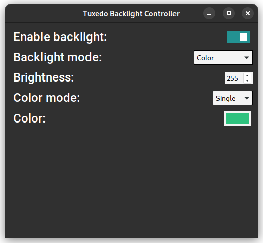
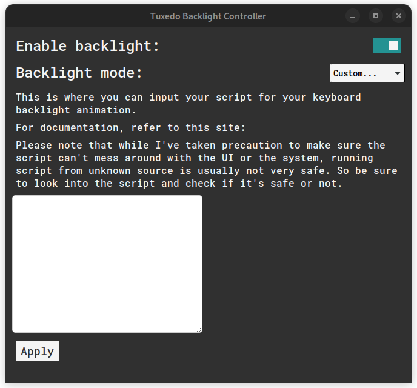

# Better Tuxedo Keyboard Backlight Controller
A minimal UI to control the backlight of Tuxedo/Clevo compatible keyboard.


## Index:
- ### [I. Why is it better?](#i-why-is-it-better-1)
- ### [II. How to use?](#ii-how-to-use-1)
- ### [III. Build](#iii-build-1)
  - #### [1. Dependencies](#1-dependencies-1)
  - #### [2. Steps to build](#2-steps-to-build-1)
- ### [IV. Documentations](#iv-documentations-1)
  - #### [1. Custom keyboard backlight script](#1-custom-keyboard-backlight-script-1)
- ### [V. Contribute](#v-contribute-1)
- ### [VI. License](#vi-license-1)

## I. Why is it better?
- It's bundled in an AppImage (which you can find in th Releases page) so you don't have to install any package.
- It have a simple but clean UI.
- It give you more control like the brightness or the backlight color which you can pick from over 16.7 million different colors.
- It allow you to create custom keyboard backlight animation using JavaScript

## II. How to use?
- Download the AppImage from the Releases page
- Run it
- That's it.

## III. Build
### 1. Dependencies
- NodeJS ([https://nodejs.org/en/](https://nodejs.org/en/))
- Rust ([https://www.rust-lang.org/](https://www.rust-lang.org/))
  - Rustup
  - Cargo

### 2. Steps to build
- Clone the repository
```bash
git clone https://github.com/QuanMCPC/TuxedoBacklightController
cd TuxedoBacklightController
```

- Install required `npm` dependencies
```bash
npm install
```

- If you want to directly run the program for debugging purposes:
```bash
npm run tauri dev
```

- OR if you want to build the program:
```bash
npm run tauri build
```

## IV. Documentations
### 1. Custom keyboard backlight script
A custom keyboard backlight script allow you to write JavaScript code to animate the backlight of keyboard. This is achieved by continuously sending data to the Tuxedo Keyboard kernal module (it's the same as you changing the settings very fast).


#### a. Syntax of a script
```javascript
onmessage = (e) => {
    // ...

    postMessage(...)
}
```
To be able to run the script, a [`Worker`](https://developer.mozilla.org/en-US/docs/Web/API/Worker), which you can think of it like a separate thread, will be created. This is to make sure the script can't even touch the UI or the system, and to make sure the script won't affect the UI of the program.

And to be able to communicate with the main thread, the script need to register an `onmessage` event with only one arguments (in this example, it's `e`) to get messages from the program.
> NOTE: To be able to actually read the data that the program sent, you need to read `e.data`

Also, to communicate back the program from the script, it need to call `postMessage` with the data that it want to send back.

#### b. Communication

***PREPARE***
> When **the script** is applied (by pressing the `Apply` button), **the program** will sent a request below to ask for information (like: what's the name of this custom mode?, or: what settings does the script want to show to the user?)
```js
// program -> script (this is what will be in `e.data`)
{"status": "need_more_info"}
```

> **The script** will have to respond back with the required information. Refer to the example below to know what they are. Do note that the script need to respond under 5 seconds, or else the program will consider the script as timed out.
```js
// script -> program (this is what will be needed in `postMessage(...)`)
{
  "name": "Noice Animation",
  "configurable_settings": [ // This is the settings that you might ask the user for the script. This is optional.
    {
        "id": "begin_color", // This is what the program will use to give the script the information it need.
        "description": "Begin color", // This is what will be display to the user to give them info about what this settings do.
        "type": "color" // This can be color, number or boolean
    },
  ]
}
```

> And done! At this point, no communications will happen until the user press `Start`

***START***
> When **the script** is started, **the program** will send to **the script** information like the settings, the current settings of the keyboard, etc. Refer to the example below to know what they are.
```js
// program -> script (this is what will be in `e.data`)
{
  "status": "continue",
  "current_state": { // This is the current state of the keyboard
    "brightness": "255",
    "color_left": "ffffff",
    "color_center": "ffffff",
    "color_right": "ffffff",
    "color_extra": "ffffff",
    "mode": "0", // ignore this attribute
    "state": "1", // keyboard backlight: 1: on, 0: off
  },
  "settings": { // This is the settings that the script has asked the user
    "begin_color": "00ff00"
  },
  "delta_time": 0.016 // Delta time: This is the time passed between the current frame and last frame. Very useful for animation.
}
```

> **The script** will have to send back information for the new state of the keyboard.
```js
// script -> program (this is what will be needed in `postMessage(...)`)
{ // This is what will be used by the program to set the new state for the keyboard
  "brightness": "255",
  "color_left": "0xffff00", //It's VERY important to send the color in 6 hex digits WITH the "0x" prefix
  "color_center": "0xffff00",
  "color_right": "0xffff00",
  "color_extra": "0xffff00",
  "mode": "0", // it's best that you leave this as "0"
  "state": "1", // it's best that you leave this as "1"
}
```

> And everything start over. The program send data to script, the script send data to program, and just that like on every "animation frame" (refer to [`requestAnimationFrame`](https://developer.mozilla.org/en-US/docs/Web/API/window/requestAnimationFrame) for more info)

> NOTE: The script will have to constantly send back data, even if the script didn't intend on changing the keyboard settings on every single frames.

***EXAMPLE***
> This example script will constantly change the keyboard backlight to either of two colors every amount of specified seconds.
```javascript
var time = 0, firstColor = true
onmessage = (e) => {
  switch (e.data.status) {
    case "need_more_info":
      postMessage({
        "name": "Flickerer",
        "configurable_settings": [
          {
            "id": "first_color",
            "description": "First color",
            "type": "color"
          },
          {
            "id": "second_color",
            "description": "Second color",
            "type": "color"
          },
          {
            "id": "delay",
            "description": "Time between each switch to either color",
            "type": "number"
          },
        ]
      })
      break
    case "continue":
      time += e.data.delta_time
      if (time >= e.data.settings.delay) {
        time = 0
        firstColor = firstColor ? false : true
      }
      var first = "0x" + e.data.settings.first_color.substring(1)
      var second = "0x" + e.data.settings.second_color.substring(1)
      if (firstColor) {
        postMessage({
          brightness: "255",
          color_left: first,
          color_center: first,
          color_right: first,
          color_extra: first,
          mode: "0",
          state: "1",
        })
      } else {
        postMessage({
          brightness: "255",
          color_left: second,
          color_center: second,
          color_right: second,
          color_extra: second,
          mode: "0",
          state: "1",
        })
      }
      break
    }
}
```

## V. Contribute
PR and Issues are always welcome. Although don't expect active development or quick responses since I have to study a lot these days.

## VI. License
Released under MIT License